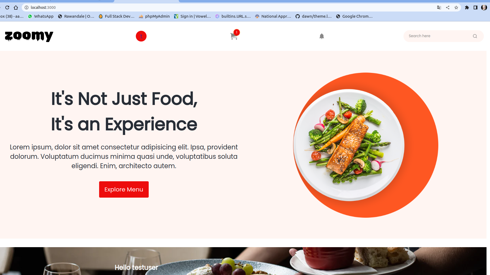
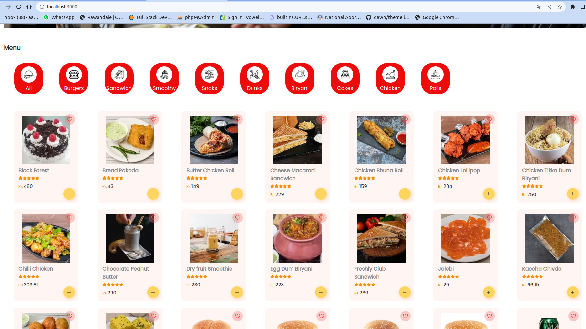
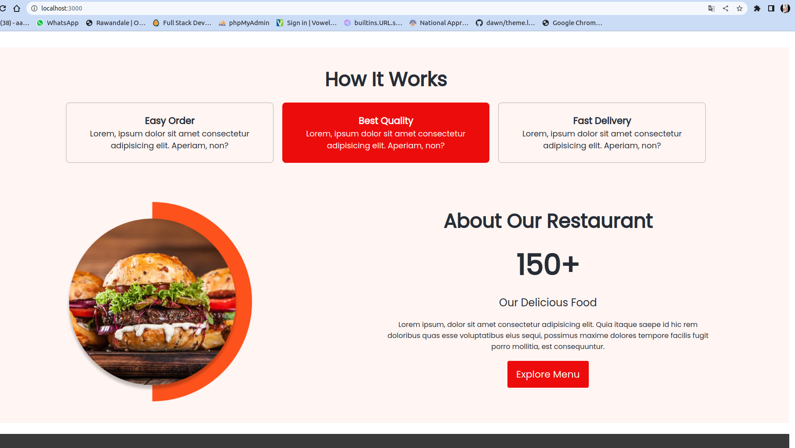

# Zoomy_food_delivery_app

> Food Delivery app made using MERN stack  
> APP uses morden React and NodeJS features like Modules ,Skeletons , React Portals ,Redux thunk 
> Followed MVC architecture and microservices for serever side

## ⚙️ Detailed Functionality

- Users have to authenticate themselves by Email
- User can add carts items to cart
- Users can update quantity delete the item
- User can check the summry of ordre like items price ,delivery price and total
- User can select COD or online (Razorpay) payment for order
- After Placing order user will redirect to ordere details page and recives an email of order
- User can view there old orders and profile
- User can add , edit or delete address while checkout

## 🚀 Tech and Tools Used

- React.JS ,Redux ,NodeJS ,ExpressJs,MongoDB
- VS code,Heruko
- React Icons,REST APIS ,JWT ,GoogleAPIs,Yup

## 📸 Screenshots

## Home Page

 

## Menu Page

 

## About Page

 

# zoomy_food_delivery_app
# zoomy_food_delivery_app
# zoomy_food_delivery_app
